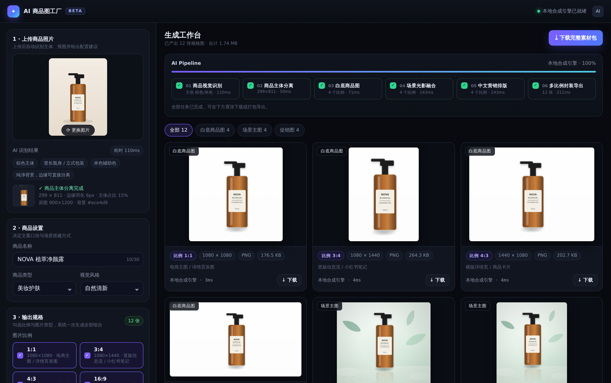

# AI 商品图工厂

上传一张普通商品照片，一次产出多规格的**白底商品图 / 场景主图 / 促销图**，以及**商品标题 + 3 条卖点**，并支持一键下载完整素材包。



## 它做什么

| 环节 | 说明 |
| --- | --- |
| 上传识别 | 估计背景色、洪水填充去背、边缘羽化，提取主色与商品形态标签 |
| 商品设置 | 商品名称、8 种商品类型、8 种视觉风格 |
| 输出规格 | 勾选 1:1 / 3:4 / 4:3 / 16:9 与三类图片，系统一次生成全部组合 |
| 营销内容 | 自动生成商品标题、3 条卖点、促销主/副标题与角标，全部可手改 |
| 结果与导出 | 每张图标注**类型 · 比例 · 尺寸 · 格式 · 体积 · 使用场景**，支持单张下载与整包 ZIP 导出 |

### 输出规格表

| 比例 | 导出尺寸 | 典型用途 |
| --- | --- | --- |
| 1:1 | 1080 × 1080 | 电商主图 / 详情页首图 |
| 3:4 | 1080 × 1440 | 竖版信息流 / 小红书笔记 |
| 4:3 | 1440 × 1080 | 横版详情页 / 商品卡片 |
| 16:9 | 1920 × 1080 | 首页横幅 / 落地页 Banner |

| 图片类型 | 格式 | 说明 |
| --- | --- | --- |
| 白底商品图 | PNG | 纯白背景、居中构图、约 12% 留白，符合主流电商主图审核规范 |
| 场景主图 | JPG | 按视觉风格搭建场景，统一光影、接地投影与倒影 |
| 促销图 | JPG | 在场景图上叠加中文营销排版：角标 / 主标题 / 副标题 / 3 条卖点 |

素材包结构：

```
NOVA_植萃净颜露_AI素材包/
├── 01_白底商品图/白底商品图_1x1_1080x1080.png …
├── 02_场景主图/场景主图_16x9_1920x1080.jpg …
├── 03_促销图/促销图_3x4_1080x1440.jpg …
├── 04_营销文案/标题与卖点.txt、copy.json
├── 素材清单.csv        # 类型 / 比例 / 尺寸 / 格式 / 体积 / 使用场景 / 文件名
└── README.txt          # 生成参数与视觉识别记录
```

## 快速开始

```bash
npm install
npm run dev     # http://localhost:3000
```

零配置即可跑通全流程：不配置任何 API Key 时，识别、抠图、场景合成、中文排版、编码导出**全部在浏览器本地完成**，图片不会上传到任何第三方。

## 在线预览与部署

**单文件在线演示**

```bash
npm run build:static   # 生成 dist/index.html
```

产物是一个完全自包含的 HTML（内联 CSS / JS / 示例商品图，约 380KB，不请求任何外部资源）：双击就能打开，也可以丢到任意静态托管（GitHub Pages、对象存储、Cloudflare Pages）。演示模式下没有后端，文案与生图都走内置引擎，界面会顶部说明这一点。

页面在 claude.ai 的 Artifact 沙箱里运行时，浏览器自发的下载会被拦截，`lib/download.ts` 会自动改用宿主的 downloads 能力保存单张图片（ZIP 不在允许的格式内，需本地导出）。

**完整站点部署（带 API 路由）**

推到 Vercel / Netlify 等支持 Next.js 的平台即可，Root Directory 选 `ai-product-image-factory`，构建命令 `npm run build`。需要真实生图能力时在平台的环境变量里配置下面这些 Key。

## 接入真实生图模型（可选）

复制 `.env.example` 为 `.env.local` 并填写：

```bash
IMAGE_PROVIDER=gemini          # local | gemini | openai
GEMINI_API_KEY=...             # 或 OPENAI_API_KEY
ANTHROPIC_API_KEY=...          # 配置后由 Claude 写标题与卖点
```

- 配置后，`/api/generate` 会带着商品照片与结构化提示词调用生图模型，返回图再统一裁切到目标像素规格。
- 模型调用失败或未配置时**自动回退本地合成引擎**，界面上会提示回退原因，生产流程不中断。
- 提示词在 `lib/prompts.ts`，包含「不得改写包装文字、不得增删部件」等一致性约束，以及每种比例的构图说明。

## 代码结构

```
app/
  page.tsx                 # 页面外壳
  api/generate/route.ts    # 生图入口（能力探测 GET + 生成 POST）
  api/copy/route.ts        # 文案生成（Claude / 内置引擎）
components/
  Factory.tsx              # 状态编排：上传 → 识别 → 生成 → 导出
  ConfigPanel.tsx          # 左侧配置面板
  Pipeline.tsx             # 6 步流水线进度
  Gallery.tsx              # 结果画廊 + 灯箱预览
lib/
  specs.ts                 # 比例 / 图片类型 / 类目 / 风格与调色板
  vision.ts                # 视觉识别与主体分离（Canvas）
  render.ts                # 本地合成引擎：三类图的构图、光影与中文排版
  copy.ts                  # 文案引擎与大模型提示词
  prompts.ts               # 生图提示词
  pack.ts                  # ZIP 打包与素材清单
  download.ts              # 保存文件（<a download> / Artifact downloads 能力）
  providers.ts             # Gemini / OpenAI 适配器
static/entry.tsx           # 单文件演示入口
scripts/build-static.mjs   # 打包成自包含 dist/index.html
```

流水线的 6 个步骤与界面一一对应：商品视觉识别 → 商品主体分离 → 白底商品图 → 场景光影融合 → 中文营销排版 → 多比例封装导出。

## 已知边界

- 主体分离基于背景洪水填充，适合背景较干净的商品照；背景复杂时会自动保留原图环境并在识别标签中说明。
- 本地合成引擎产出的是**规范化的版式图**（真实商品 + 程序化场景），不是模型重绘的摄影级场景；需要摄影级效果时接入生图模型即可。
- 浏览器需要支持 Canvas 2D 与 `createImageBitmap`（Chrome / Edge / Safari 近三年版本均可）。
